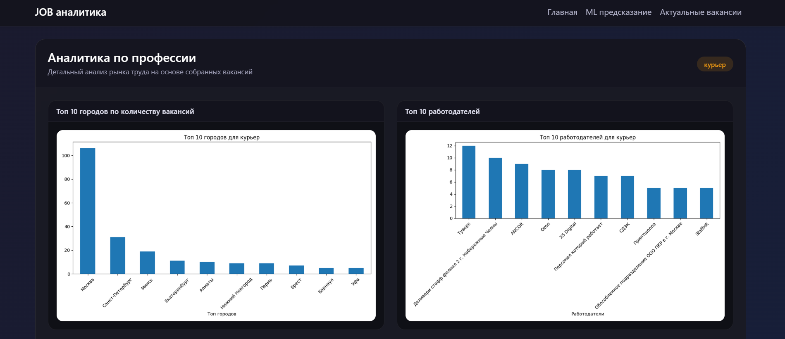

# JOB Analyzer - JOB Аналитика 

Сервис по аналитике рынка труда и предсказании зарплат на основе алгоритма Gradient Boosting. 
Данные были собраны с онлайн - платформы HH.ru

## Технологии 
- **Backend:** Python 3.14.3, Flask 
- **ML:** Scikit-learn (GradientBoostingRegressor)
- **База данных:** SQLite 
- **Парсинг:** requests
- **Аналитика** Pandas, matplotlib 

## Математическая модель 

### Математическая постановка задачи 

- x - вектор признаков (город, профессия, работодатель, валюта)
- y - целевая переменная (зарплата)
- ŷ = f(x) - предсказание модели (расчетное значение зависимой переменной в регрессионном анализе)

### Функция потерь 

- **Объяснение** - математическая операция, которая позволяет измерить насколько модель ошибается или расстояние между реальностью предсказания и предсказания модели 

- **Вид функции** - L = (1/n) * Σ(y_i - ŷ_i)^2 (MSE)
- Объяснение функции математически: 
    - (y_i - ŷ_i)^2: находим квадрат ошибки для каждого случая 
    - Σ - сложим воедино все случаи для индивидуального показателя 
    - 1/n: берем среднюю арифметическую (находим среднее)
- **Главная фишка**: штрафы за большие ошибки (чтобы модель недопускала критические ошибки)

### Градиентный бустинг 

1. Инициализация - F₀(x) = argminΣL(y_i, c)
    - y_i: реальные данные 
    - с: константа, которую хотим угадать 
    - L: функция потерь (выше)
    - argmin: набор аргументов, при котором сумма всех ошибок будет самой маленькой 
- **Важно:** Поэтому самое выгодное стартовое число - это средняя арифметическая 

2. Расчет градиентов - r_i = -[∂L(y_i, F₀(x))/ ∂F(x_i)]
    - ∂L/∂F: это производная функции потерь. Показывает куда нужно изменить F, чтобы уменьшить ошибку 
    - знак минус: показывает в какую сторону надо изменять 

3. Обучение дерева - h_t = argminΣL(r_i - h(x_i))^2
    - дерево перебирает все возможные признаки, чтобы найти разбиение, которое уменьшит дисперсию остатков 

4. Обновление (F_t) - F_t(x) = F_t-1(x) + η * h_t(x)
    - F_t(x): то что предсказывали 
    - h_t(x): параметр как улучшить дерево
    - η (learning rate): фиксированный вес, например 0.1, защита от случайных шумов

**Суть алгоритма:** - построить математическим путем цепочку слабых моделей, где каждая из последующих чуть чуть исправляет ошибку предыдущего или способ минимизировать функцию потерь 

### Метрики качества модели 
- MAE = (1/n) * Σ|y_i - ŷ_i| - средняя ошибка в рублях в чистом виде 
- R^2 = 1 - (Σ(y_i - ŷ_i)^2) / (Σ(y_i - ȳ)^2) - доля объясненной дисперсии 
    - Числитель: ошибка модели 
    - Знаменатель: общий разброс данных (дисперсия), как если бы модель не предсказывала вообще 
    - минус 1 на дробь: показатель качественности 

### Доверительный интервал 

- ŷ ± z * σ
    - z: z = 1.96 - 95% того, что данные в диапазоне 
    - σ: стандартное отклонение 

## Скриншоты 

### Главная страница 

### Раздел Аналитика 

### Предсказание зарплаты  

## Установка и запуск 

1. Клонировать репозиторий 
    `git clone https://github.com/Leonid2005ponchik/Job-Analyzer.git`
    `cd Job_analyzer` 

2. Создать виртуальное окружение
    `python -m venv venv`
    `source venv/bin/activate` # Linux или Mac 

    `venv\Scripts\activate` # Windows 

3. Установка зависимостей 
    `pip install -r requirements.txt`

4. Инициализировать базу данных 
    `python src/db/database.py` 

5. Запуск сервера 
    `python src/web/app.py`

- **Как понять, что работает:** Running on http://127.0.0.1:5000 

## Пример использования 

1. На главной странице можно узнать последние новости мира перейдя по ссылке 
2. На главной странице можно узнать свежие вакансии (первая часть подгружается из БД, потом динамические через API)
3. На главной странице введите в поле профессию 
    - Нажмите анализировать
    - Модель покажет: 
        - топ 10 городов по количеству вакансий 
        - топ 10 работодателей
        - распределение зарплат (средняя, медиана)
        - динамика зарплат по месяцам 
        - Распределение зарплат по городам 
        - распределение зарплат по работодателям 
4. В заголовке главной страницы можно перейти на страницу актуальные вакансии
5. На странице актуальных вакансий можно ввести название вакансии и города 
- Модель покажет вам 20 актуальных вакансий по введеной вакансии 
6. На главной странице можно в заголовке можно перейти на страницу ML предсказание 
- Необходимо ввести название вакансии, город, работодателя по желанию 
- Модель покажет - предсказанную зарплату 

## Лицензия 

Проект распространяется под лицензией [MIT](https://opensource.org/licenses/MIT)

## Автор 
- **Леонид Агарков** - [GitHub](https://github.com/Leonid2005ponchik)
- **Связь** [vk](vk.com/socket1155) | [email](homoest.123@gmail.com)

## Статус проекта 

- В активной разработке 

## Планы по развитию проекта 
1. Доработка функционала: 
    - экспорт PDF 
    - Решить проблему парсинг актуальных вакансий 
    - Сделать качественный вывод аналитики 
    - Исправить мелкие баги 
    - Сделать более качественно ML модель 
2. Pytest 
3. Новые математические операции в проект
4. Docker 
5. Деплой 

## Благодарность 

- Выражаю большую благодарность онлайн - сервису HH.ru за возможность предоставления данных по вакансиям 
